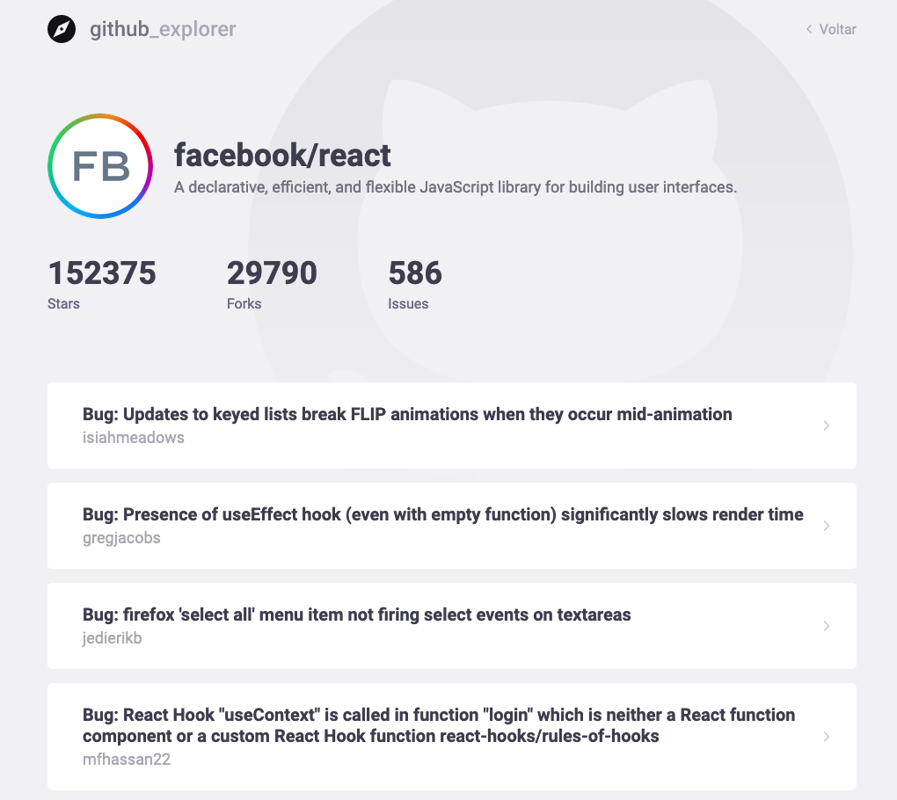

<br />
<p align="center">
  <a>
    
  </a>
</p>

<p align="center">
  Explore amazing Github Repositories. Built with ReactJS, TypeScript and Styled Components.
</p>

<p align="center">
  <a>
    
  </a>

  <a>
    
  </a>
</p>


## Table of Contents

- [Features](#features)
- [Installation](#installation)
- [Feedback](#feedback)

## Features

A few of the things you can do with Github Explorer:

* Explore for github repositories and add them to your list
* View the list of issues of a repository
* View the list of forks of a repository
* View the list of stargazers of a repository

<p align="center">
  
</p>

<p align="center">
  
</p>

<br>

## Installation

First of all, you may clone this repo

```
  git clone https://github.com/leandrocanabarro/github-explorer.git
```

Run the following scripts in order to execute the application in development mode

```
  // Install the dependencies
  yarn install

  // Start the application
  // yarn start
```

## Feedback

Feel free to send me feedback on [LinkedIn](https://linkedin.com/in/leandrocanabarro) or [file an issue](https://github.com/leandrocanabarro/github-explorer/issues/new). Feature requests are always welcome.
